# 星系并合过程再现

利用LSTM学习星系并合过程，尝试再现星系并合过程。

- 这里只考虑图像时间序列问题，学习并合过程，学习结果并不一定受物理机制的限制。
- 如果我们能够获得具体的物理参数，整个结果可能会得到一定的提升。
- 由于数据源较少，只是学到了几个固定的模式的并合过程

## 数据来源

数据主要来自[Gadget 2](https://wwwmpa.mpa-garching.mpg.de/gadget/)，[Flash](http://flash.uchicago.edu/site/research/)和[ILLUSTRIS](https://www.illustris-project.org/data/)模拟的结果。目前数据源并不多，可以从相关论文作者的论文中找到相关模型的视频文件。

在此感谢，师兄提供的数据。

## 参考资料

**论文**
- [知乎专栏--时空序列预测](https://zhuanlan.zhihu.com/c_1208033701705162752)

**GCN相关**

- [Spatial-Temporal Transformer Networks for Traffic Flow Forecasting](https://arxiv.org/abs/2001.02908) 
- [ASTGCN](https://github.com/guoshnBJTU/ASTGCN-r-pytorch/blob/master/paper/AAAI-GuoS.2690.pdf)

特别感谢[SEU-AI蜗牛车](https://www.zhihu.com/people/seu-aigua-niu-che/columns)，整理的时间序列相关的文章，让新手可以快速找到核心解决思路和方案。

## 模型和技术

目前主要还是基于`LSTM`和`RNN`展开的探索，但是如果除了图片数据外，有更深层次数据（恒星和气体的分布，一些物理机制，中心黑洞的信息）应该可以得到更佳的预测结果，而这里只使用图像数据信息。

另一个方向就是利用图神经网络，受限于本人目前知识储备，暂不做讨论。

现有模型主要有`ConvLSTM`,`ConvGRU`,`PredRNN`,`TrajGRU`，这些模型一般为一些现有模块的重组或者改造，感觉缺乏理论建设，主要还是在细微之处的设计和思考，目前看来还有一段路要走。

本人作为小学生，也只是在尝试探索，学习前辈们的经验，把他们走过的路走一遍，希望能为之后续工作奉献一份力量。

### Simple ConvLSTM

采用多层`ConvLSTM`，简单的堆叠来实现星系并合过程的短期预测。

`Loss function`采用`MSE`和`SSIM`.

### JrajGRU

...

## 结果

### Simple ConvLSTM

- 短期预测

$$
\hat{v}_{n+1} = \argmax p(v_{n+1}|\tilde{v}_{n-j+1}, \tilde{v}_{n-j++2},\ldots,\tilde{v}_{n})
$$

- 长期预测

$$
\hat{v}_{n+k} = \argmax p(v_{n+k}|\tilde{v}_{n-j+1}, \tilde{v}_{n-j++2},\ldots,\tilde{v}_{n},\hat{v}_{n+1}\ldots,\hat{v}_{n+k-1})
$$

#### MSE效果

|训练集|测试集|测试|
|:----:|:----:|:---:|
|short term|short term|long term(k=10)|
|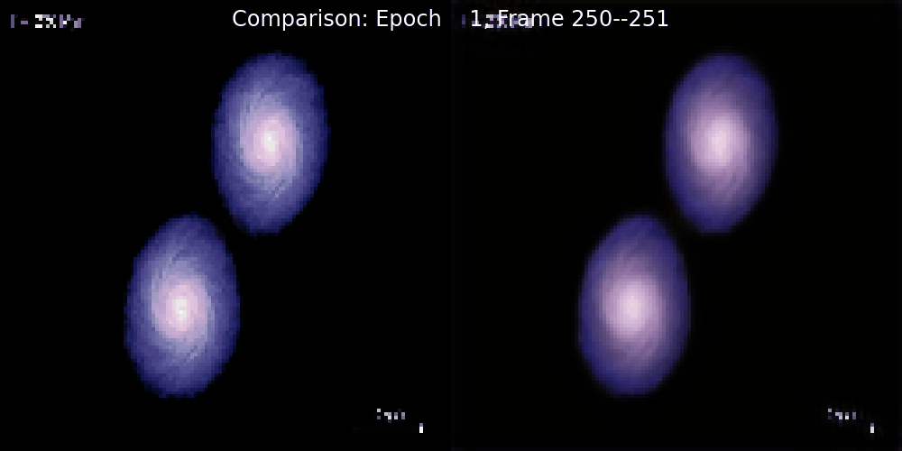||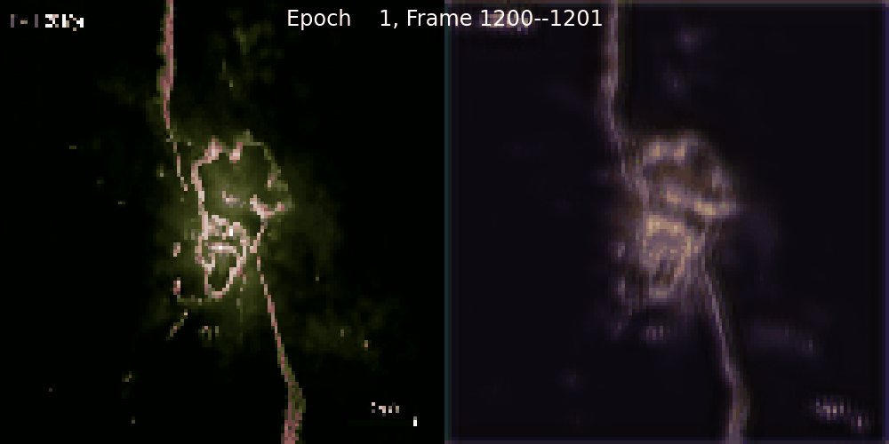|
|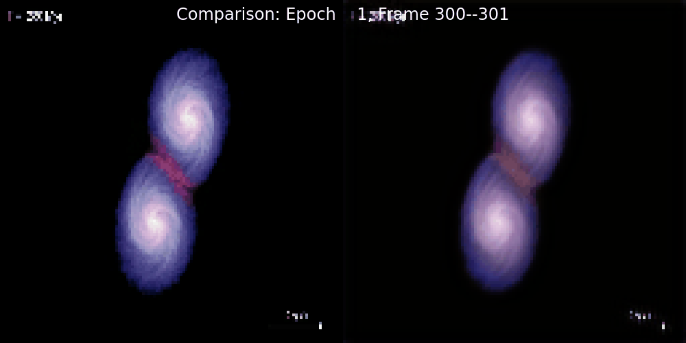||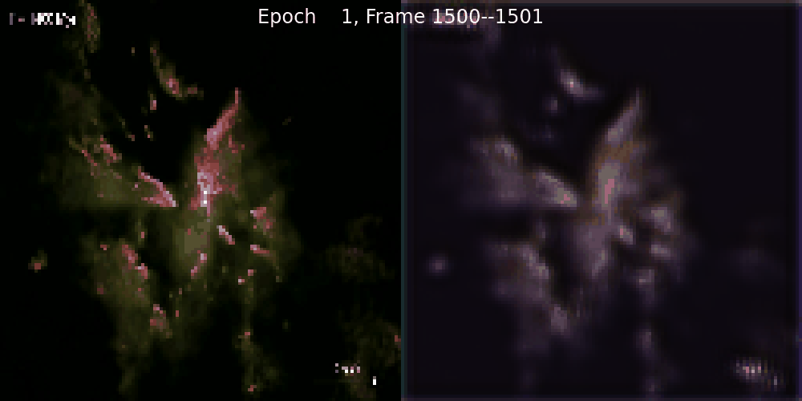|
|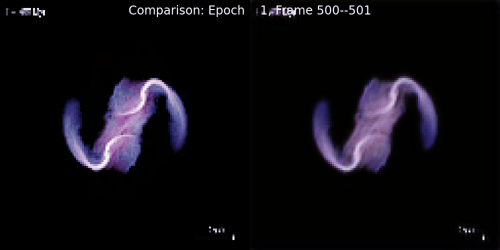||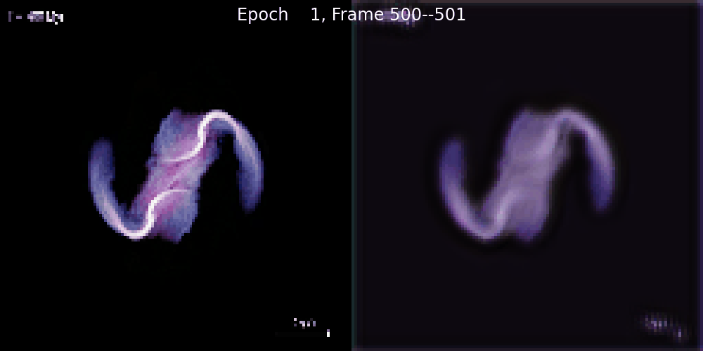|

#### SSIM效果

|训练集|测试集|测试|
|:----:|:----:|:---:|
|short term|short term|long term(k=20)|
|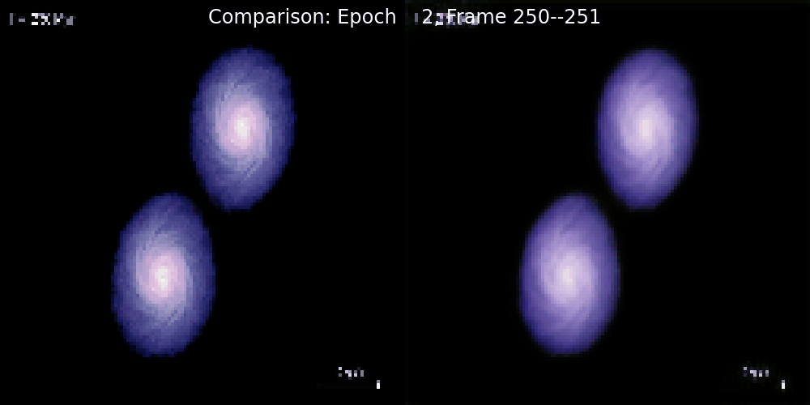||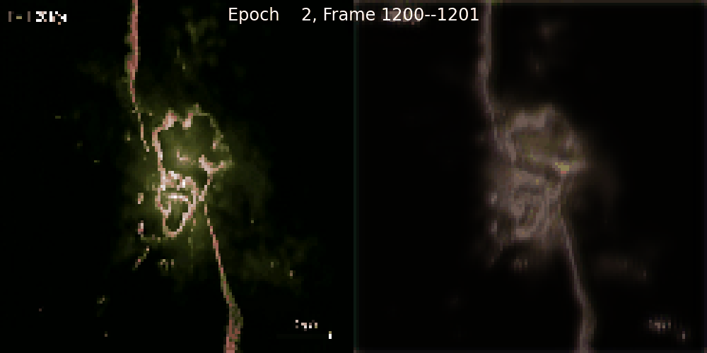|
|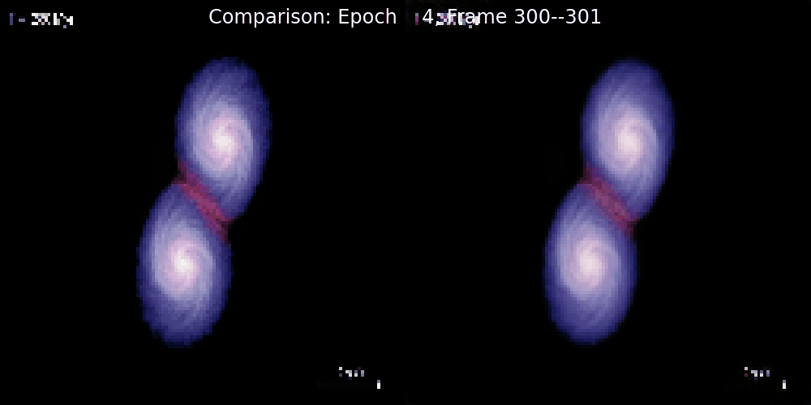||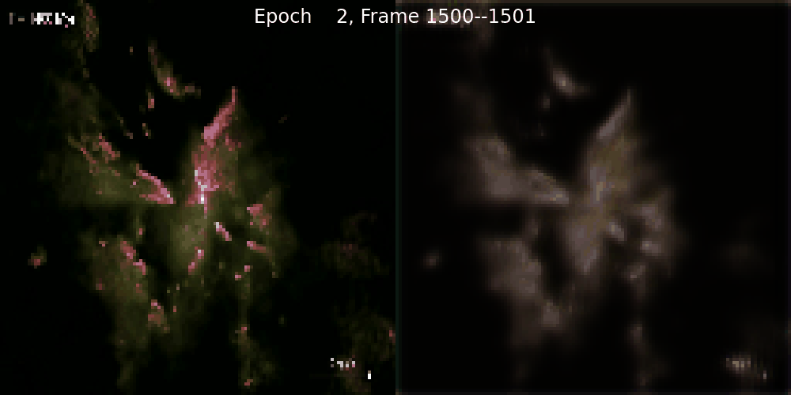|
|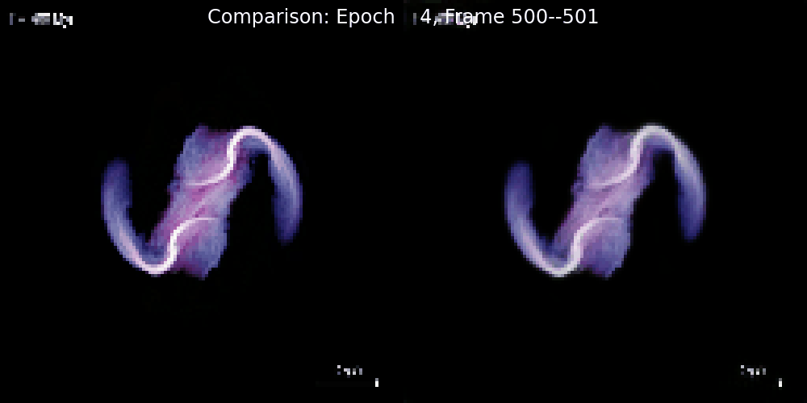||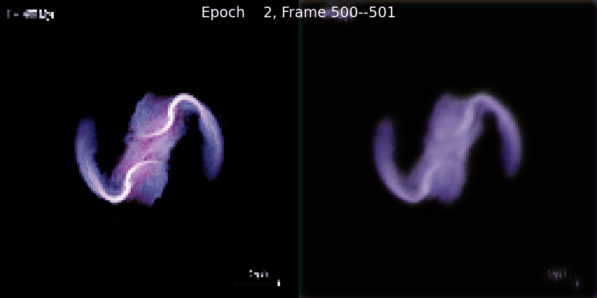|
||||

就这个结果看来，几个简单的`ConvLSTM`的堆叠，能有如此表现，我个人还是比较满意的。

- 短期的预测表象相当不错，测试集为并合过程后期，相关的整体结构特征并没有在训练集中出现，预测的行为基本一致，只是颜色上略有差别。
- 长期的预测，表现的相当不好，原因也是这个简单的堆叠导致的，经过训练后短期的一些行为特征会被长期训练覆盖掉，而且用一个状态转换模式来表征所有的变化显然是不合适的，一般的做法是引入`Attention`机制，具体有多种实现方式，主要表现在，对不同层级间特征的处理方式不同，于此同时可以引入各种经典的网络结构的一些特征（UNET（关注中间过程信息流的传递）,multi-Attention（关注中间过程的输入信息流）,GAN(从输入和输出端来做决策调整)...）。

### 待更新...
