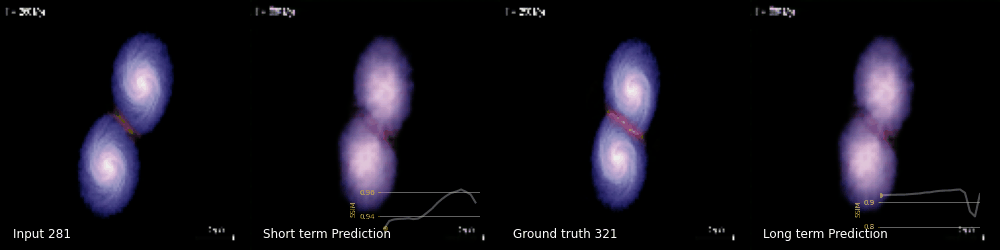
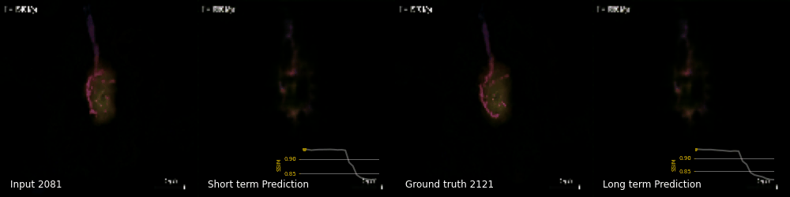

# 星系并合过程再现

利用LSTM学习星系并合过程，尝试再现星系并合过程。

- 这里只考虑图像时间序列问题，学习并合过程，学习结果并不一定受物理机制的限制。
- 如果我们能够获得具体的物理参数，整个结果可能会得到一定的提升。
- 由于数据源较少，只是学到了几个固定的模式的并合过程

## 1. 数据来源

数据主要来自[Gadget 2](https://wwwmpa.mpa-garching.mpg.de/gadget/)，[Flash](http://flash.uchicago.edu/site/research/)和[ILLUSTRIS](https://www.illustris-project.org/data/)模拟的结果。目前数据源并不多，可以从相关论文作者的论文中找到相关模型的视频文件。

在此感谢，师兄提供的数据。

## 2. 参考资料

**论文**
- [知乎专栏--时空序列预测](https://zhuanlan.zhihu.com/c_1208033701705162752)

**GCN相关**

- [Spatial-Temporal Transformer Networks for Traffic Flow Forecasting](https://arxiv.org/abs/2001.02908) 
- [ASTGCN](https://github.com/guoshnBJTU/ASTGCN-r-pytorch/blob/master/paper/AAAI-GuoS.2690.pdf)

特别感谢[SEU-AI蜗牛车](https://www.zhihu.com/people/seu-aigua-niu-che/columns)，整理的时间序列相关的文章，让新手可以快速找到核心解决思路和方案。

## 3. 模型和技术

目前主要还是基于`LSTM`和`RNN`展开的探索，但是如果除了图片数据外，有更深层次数据（恒星和气体的分布，一些物理机制，中心黑洞的信息）应该可以得到更佳的预测结果，而这里只使用图像数据信息。

另一个方向就是利用图神经网络，受限于本人目前知识储备，暂不做讨论。

现有模型主要有`ConvLSTM`,`ConvGRU`,`PredRNN`,`TrajGRU`, `E3D-LSTM`，这些模型一般为一些现有模块的重组或者改造，感觉缺乏理论建设，主要还是在细微之处的设计和思考，目前看来还有一段路要走。

$$
Loss  = \alpha \mathbf{SSIM} + (1-\alpha) \mathbf{MSE}
$$

本人也只是在尝试探索，学习前辈们的经验，把他们走过的路走一遍，希望能为之后续工作奉献一份力量。

### 3.1. Simple ConvLSTM

- 采用多层`ConvLSTM`，简单的堆叠来实现星系并合过程的短期预测。SSIM基本稳定在0.86。
- 改变keneral-size和stride后，参数增加一倍，反而更快了。特征提取变换后，需要更多个epoch的训练。

### 3.2. GAN-ConvLSTM

- 参考 [Satellite Image Prediction Relying on GAN and LSTM Neural Networks](https://ieeexplore.ieee.org/document/8761462)

论文中的思路分两步走
- 首先利用GAN训练生成器，并把它当做下一步的解码器。
- 然后再训练一个编码器，把降维后的特征，传递给GAN 训练的解码器，最终输出与真实数据对比，来训练编码器。
  
思路很巧妙，两步分开训练，很好的利用了GAN，并且避开了编码器与解码器间参数不均衡带来的潜在问题。

这里采用类似结构和思路，并非原论文中结果复现。

可能存在的问题：
- 长期预测，重度依赖解码器即GAN的生成器的能力。
- 若再对编码器。。。。

### 3.3. E3D-LSTM

参考：[Eidetic 3D LSTM: A Model for Video Prediction and Beyond](https://github.com/google/e3d-lstm)

### 3.4. MIM

参考:[Memory In Memory Networks](https://github.com/Yunbo426/MIM)

## 4. 结果

**普遍问题**
- 由于原始数据集相邻帧频间本身就很相似，所以对于每个训练样本取帧频间隔$interval=2$，但是不同阶段的帧频间的差别大小不同，这样取还是有一些问题的。
- 由于上述原因，部分结果的`SSIM`值比较大，其实并不是模型多么优秀。所以注重不同模型间的对比，后期加入moving minst数据集的测试结果。

### 4.1. Simple ConvLSTM

- **Short term**

$$
(\hat{v}_{n+k},\ldots,\hat{v}_{n+1}) = \argmax p(v_{n+k},\ldots,v_{n+1}|\tilde{v}_{n-j+1}, \tilde{v}_{n-j+2},\ldots,\tilde{v}_{n})
$$

- **Long term**
    - First step
$$
\hat{v}_{n+1} = \argmax p(v_{n+1}|\tilde{v}_{n-j+1}, \tilde{v}_{n-j+2},\ldots,\tilde{v}_{n})，j=20
$$
    - Then
$$
\hat{v}_{n+k} = \argmax p(v_{n+k}|\tilde{v}_{n+k-j-1}, \tilde{v}_{n+k-j},\ldots,\tilde{v}_{n},\hat{v}_{n+1}, \ldots,\hat{v}_{n+k-1}), j=20, k=1,2,3,\ldots
$$

#### 4.1.1. Demo

|j=20, k=30|
|:---:|
||
||
||
||
||
||
||
||

- 设置`ConvLSTM`的`keneral_size=[3x3],stride=2`，并进行了反卷积过程，这样的结果比`stride=1`的结果稍差一些。
- 但训练集和测试集的长期预测要比简单的堆叠要好很多。
- 短期的预测表象相当不错。
- 长期的预测，后期表现的欠佳。
- 由于图片中大量为0的区域，使SSIM的值看起来不错，应适当提高$L_2$的比例($\alpha=0.5$)，并且考虑不同区域的权重最佳。
- 训练中细微的结构并没有真正的学到。

### 4.2. GAN-LSTM

